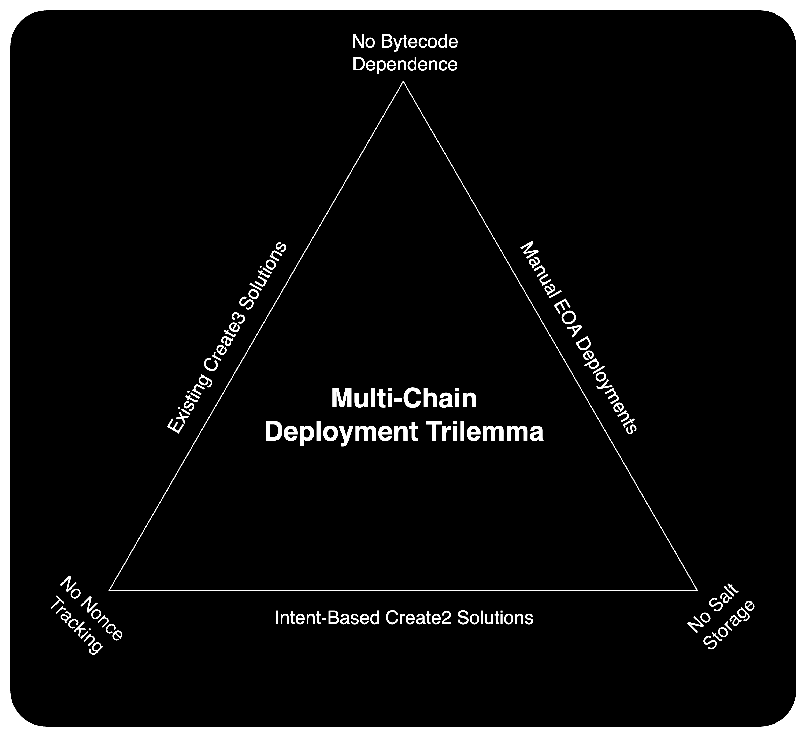

# xSafe Contracts

## Deterministic Multi-Chain Deployment

🏆Introducing xSafe, the new gold standard for intent-based CREATE3 contract deployments. Deploy your contracts to the same address on many chains–no nonces, no salts.

## The Multi-Chain Deployment Trilemma



### The Problem with EOA Deployments

Traditionally, achieving the same address on many chains requires careful (manual) EOA nonce management. Mess up the nonce once, start all over.

### The Problem with CREATE2

The `CREATE2` opcode can generate identical addresses, but when constructor arguments vary across chains, differing contract bytecode results in distinct addresses. An intent-based solution, [like this](src/create2/Create2Factory.sol), obviates salt storage, but addresses still depend on contract bytecode.

### The Problem with CREATE3

A `CREATE3` approach offers an elegant solution, irrespective of contract bytecode, but still requires users to memorize salts.

## The Solution

[xSafe](src/create3/Create3Factory.sol) achieves same-address deployment with no bytecode dependence, no nonce tracking, and no salt storage. Under the hood, salts are derived from principals' signatures, thereby allowing agents to deploy contracts on behalf of signers.

## Testing

### 1. Environment Variables

Create a `.env` file in the project root directory and add your RPC URL.

```dotenv
RPC_URL="your_rpc_url_here"
```

### 2. Install Dependencies

Install npm dependencies:

```bash
npm install
```

Install Foundry dependencies:

```bash
forge install
```

### 3. Run Tests

Execute the tests using Foundry:

```bash
forge test
```
